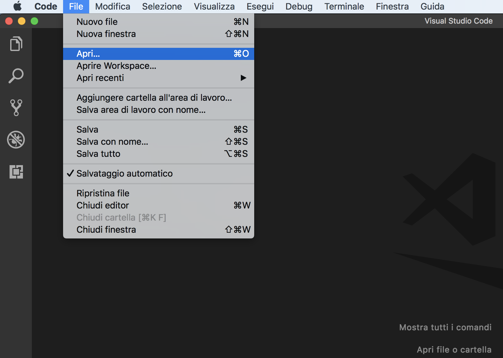

# 01-prepara-il-tuo-progetto

|                                                           | Capitolo successivo                                                                    |
| :-------------------------------------------------------- | -------------------------------------------------------------------------------------: |
| [◀︎ Introduzione](https://github.com/lykkechen/work-pop/) | [02-inizia-a-personalizzare-il-template ▶︎](../02-inizia-a-personalizzare-il-template) |

- Crea una cartella vuota, ad esempio puoi chiamarla `workshop-poplar`
- Apri **visual studio code** e apri la cartella con `File > Apri…`

<kbd></kbd>

- Crea un file `index.html`
- Vai sul sito di [Bulma](https://bulma.io/documentation/overview/start/) e copia lo **Starter template** nel file `index.html` appena creato
- Vai nella cartella `workshop-poplar` e apri il file `index.html` con un browser
  
###### Come puoi vedere hai appena una pagina web 😍

<kbd></kbd>

|                                                          | Capitolo successivo                                                                    |
| :------------------------------------------------------- | -------------------------------------------------------------------------------------: |
| [◀ Introduzione](https://github.com/lykkechen/work-pop/) | [02-inizia-a-personalizzare-il-template ▶︎](../02-inizia-a-personalizzare-il-template) |