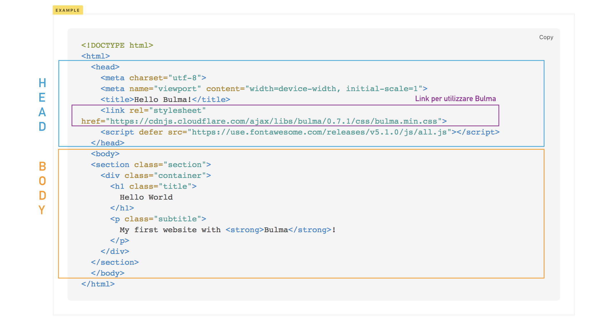

# 01-prepara-il-tuo-progetto

|                                                           | Capitolo successivo                                                                    |
| :-------------------------------------------------------- | -------------------------------------------------------------------------------------: |
| [◀︎ Introduzione](https://github.com/lykkechen/work-pop/) | [02-inizia-a-personalizzare-il-template ▶︎](../02-inizia-a-personalizzare-il-template) |

Obiettivo: creare il nostro documento HTML, un file con estensione `.html`

- Per comodità creiamo una cartella vuota, puoi chiamarla `coding-is-poplar`
- Apri **visual studio code** e apri la cartella con `File > Apri…`

<kbd></kbd>

- Crea un file `index.html`
- Vai sul sito di [Bulma](https://bulma.io/documentation/overview/start/) e copia lo **Starter template** nel file `index.html` appena creato

<kbd></kbd>

> Come puoi vedere un documento HTML è composto da due parti principali, una parte superiore chiamata 'head' (testa) e una parte inferiore chiamata "body" (corpo).

> Il head contiene il titolo della pagina (quello sulla tab), link esterni per il corretto funzionamento. Noi per utilizzare bulma inseriamo il link all'interno del head.

>Il body contiene invece tutto ciò che sarà visibile, come il i titoletti, i paragrafi, le immagini, ecc.

- Vai nella cartella `coding-is-poplar`, con il tasto destro apri con un browser `index.html` per visualizzare la pagina.

###### Come puoi vedere hai appena una pagina web 😍

<kbd></kbd>

|                                                          | Capitolo successivo                                                                    |
| :------------------------------------------------------- | -------------------------------------------------------------------------------------: |
| [◀ Introduzione](https://github.com/lykkechen/work-pop/) | [02-inizia-a-personalizzare-il-template ▶︎](../02-inizia-a-personalizzare-il-template) |