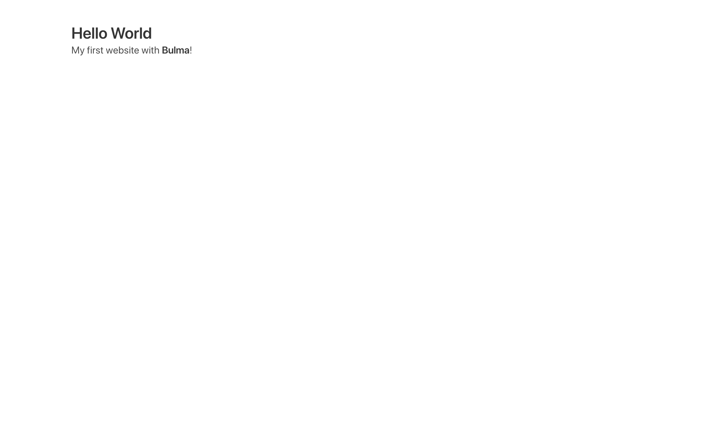

# 01-prepara-il-tuo-progetto

|                                                           | Capitolo successivo                                                                    |
| :-------------------------------------------------------- | -------------------------------------------------------------------------------------: |
| [◀︎ Introduzione](https://github.com/lykkechen/work-pop/) | [02-inizia-a-personalizzare-il-template ▶︎](../02-inizia-a-personalizzare-il-template) |

Per prima cosa possiamo creare il nostro documento HTML che sarà un file con estensione `.html`

- Per comodità creiamo una cartella vuota, puoi chiamarla `coding-is-poplar`
- Apri **visual studio code** e apri la cartella con `File > Apri…`
- Crea un file `index.html`
- Vai sul sito di [Bulma](https://bulma.io/documentation/overview/start/) e copia lo **Starter template** nel file `index.html` appena creato

Come puoi vedere un documento HTML è composto da due parti principali, una parte superiore chiamata 'head' (testa) e una parte inferiore chiamata "body" (corpo).
Il head contiene il titolo della pagina (quello sulla tab), link esterni per il corretto funzionamento, noi ad esempio per utilizzare bulma inseriamo il link all'interno del head.

Il body contiene invece tutto ciò che sarà visibile, come il i titoletti, i paragrafi, le immagini, ecc.

- Vai nella cartella `workshop-poplar` e apri il file `index.html` con un browser per visualizzarla.

###### Come puoi vedere hai appena una pagina web 😍

<kbd></kbd>

|                                                          | Capitolo successivo                                                                    |
| :------------------------------------------------------- | -------------------------------------------------------------------------------------: |
| [◀ Introduzione](https://github.com/lykkechen/work-pop/) | [02-inizia-a-personalizzare-il-template ▶︎](../02-inizia-a-personalizzare-il-template) |