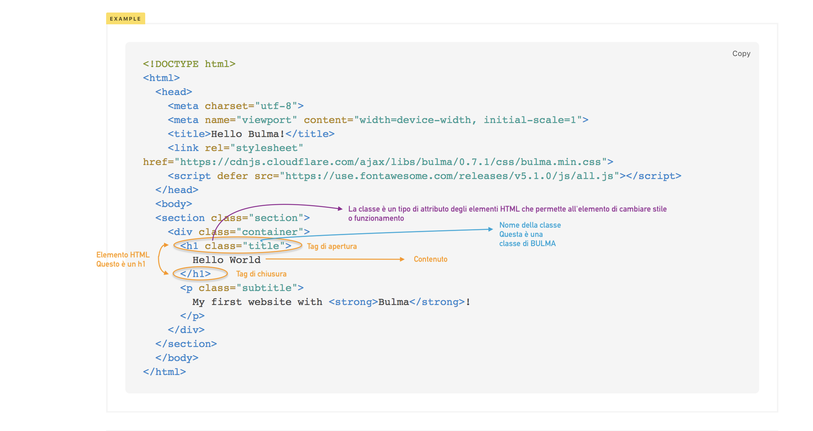
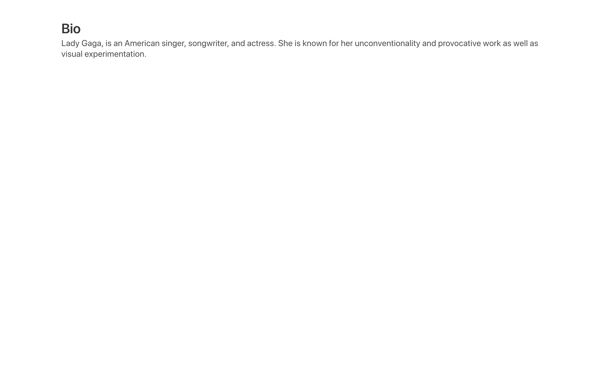

# 02-inizia-a-personalizzare-il-template

| Capitolo precedente                                                                                                                                          | Capitolo successivo                                                                           |
| :--------------------------------------------------------------------------------------------------------------------------------------------------------------- | ---------------------------------------------------------------------------------------------------: |
| [◀︎ 01-comincia-a-preparare-il-tuo-progetto](../01-comincia-a-preparare-il-tuo-progetto)  | [03-crea-un-altra-sezione ▶︎](../03-crea-un-altra-sezione) |

### Obiettivo: personalizzare il template con una piccola biografia

> Gli elementi HTML sono gli elementi costitutivi delle pagine HTML
> 
> Gli elementi sono costituiti da tag e possono avere degli attributi
> 
> I tag HTML etichettano parti di contenuto come "heading", "paragraph", "table" e così via
>
> I browser non visualizzano i tag HTML, ma li usano per rendere il contenuto della pagina

<kbd></kbd>

* Sostituisci all'interno dell'elemento `h1` il contenuto `Hello World` con `Bio`
* Sostituisci il contenuto dell'elemento `p` con una tua breve biografia
* Puoi vedere il risultato ricaricando la pagina web sul browser 🎉

<kbd></kbd>

| Capitolo precedente  | Capitolo successivo     |
| :--------------- | ---------------: |
| [◀︎ 01-comincia-a-preparare-il-tuo-progetto](../01-comincia-a-preparare-il-tuo-progetto)| [03-crea-un-altra-sezione ▶︎](../03-crea-un-altra-sezione) |