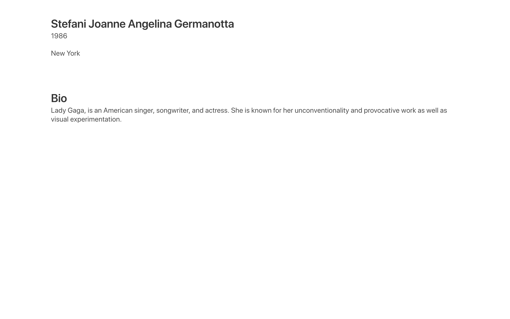

# 03-crea-un-altra-section

| Capitolo precedente  | Capitolo successivo     |
| :--------------- | ---------------: |
| [◀︎ 02-inizia-a-personalizzare-il-template](../02-inizia-a-personalizzare-il-template)| [04-aggiungi-le-prime-icone ▶︎](../04-aggiungi-le-prime-icone) |

* Creare una nuova section con un container
* Crea un titolo con il tag `h1` e inserisci il tuo nome
* Crea un paragrafo con il tag `p`  con il tuo anno di nascita
* Crea un paragrafo con il tag `p`  con il luogo di nascita

| Capitolo precedente  | Capitolo successivo     |
| :--------------- | ---------------: |
| [◀︎ 02-inizia-a-personalizzare-il-template](../02-inizia-a-personalizzare-il-template)| [04-aggiungi-le-prime-icone ▶︎](../04-aggiungi-le-prime-icone) |