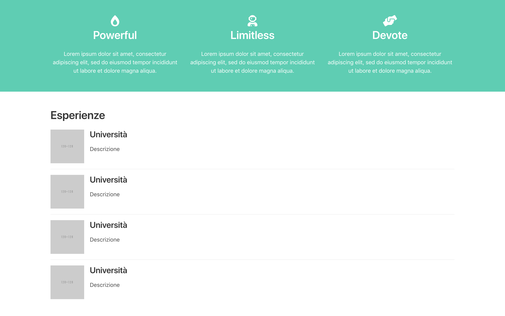

# 08-crea-section-per-esperienze

| Capitolo precedente  | Capitolo successivo     |
| :--------------- | ---------------: |
| [◀︎ 07-aggiungi-una-sezione-colorata](../07-aggiungi-una-sezione-colorata)| [09-crea-una-sezione-contatti ▶︎](../09-crea-una-sezione-contatti) |

- Crea una nuova section con un title
- Cerca su [Bulma](https://bulma.io/documentation/) l’elemento media object
- Crea un media object
- Aggiungi un div con classe  `media-left` e al suo interno inserisci un’immagine
- Sostituisci la src dell’immagine, con una tua immagine salvata nella cartella
- Sotto al media-left aggiungi un `media-content` 
- All’interno del media-content crea un `div content` con all’interno titolo e descrizione dell’esperienza

Ora hai creato il primo elemento, se ne vuoi aggiungere altri ti basta copiare e sostituire il contenuto 😍

| Capitolo precedente  | Capitolo successivo     |
| :--------------- | ---------------: |
| [◀︎ 07-aggiungi-una-sezione-colorata](../07-aggiungi-una-sezione-colorata)| [09-crea-una-sezione-contatti ▶︎](../09-crea-una-sezione-contatti) |