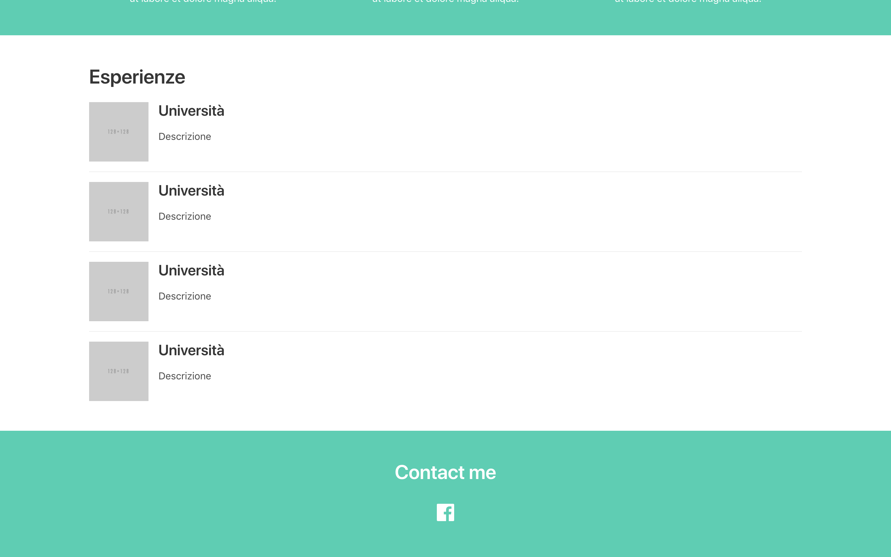

# 09-crea-una-sezione-contatti

| Capitolo precedente  |      |
| :--------------- | ---------------: |
| [◀︎ 08-crea-section-per-esperienze](../08-crea-section-per-esperienze)| [▶︎](https://github.com/lykkechen/work-pop/) |

- Crea un nuovo hero colorato
- Aggiungi un titolo per indicare che si tratta della sezione contatti
- Aggiungi degli anchor tag `<a href="..."> ... </a>`
- Inserisci all’interno dell’anchor tag l’icona di Facebook
- Inserisci all’interno di `href` il link al tuo profilo facebook

Se vuoi, puoi aggiungere altri anchor tag e inserire altri collegamenti ad altri tuoi social 😍

| Capitolo precedente  |      |
| :--------------- | ---------------: |
| [◀︎ 08-crea-section-per-esperienze](../08-crea-section-per-esperienze)| [▶︎](https://github.com/lykkechen/work-pop/) |