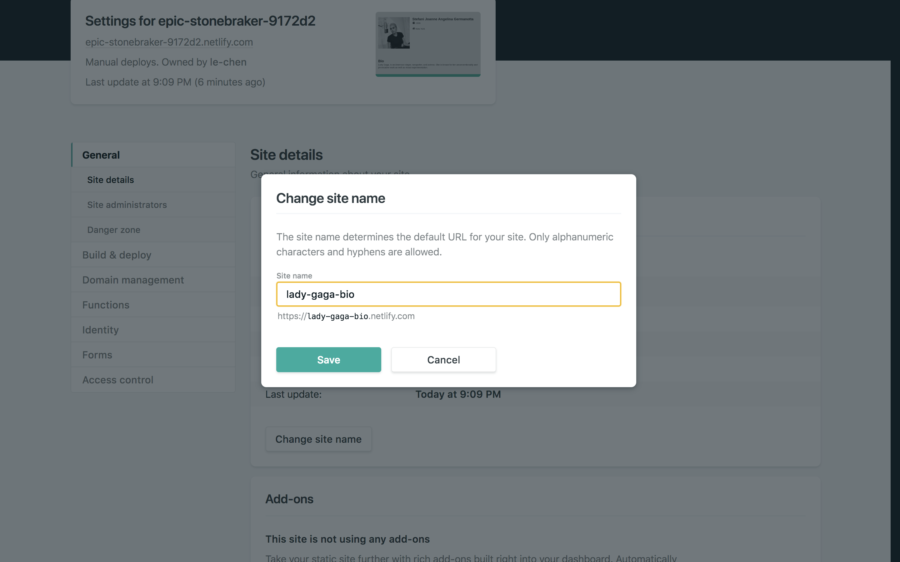

# 10-carica-online

| Capitolo precedente | Intro |
| :--------------- | ---------------: |
| [◀︎ ︎︎09-crea-una-sezione-contatti](../09-crea-una-sezione-contatti)| [https://github.com/lykkechen/work-pop/ ▶︎](https://github.com/lykkechen/work-pop/) |

- Per caricare un sito online serve un servizio che metta a disposizione uno spazio online.
Oggi utilizzerai [Netlify](https://www.netlify.com) un servizio di hosting gratuito.
- Prima di tutto dovrai crearti un account
- Dopodiché accedi al tuo account e trascina la cartella contente il tuo `index.html` ed eventuali immagini
- Ora il tuo sito è già online, può accederci cliccando sul link in alto a sinistra 🎉🎉

- Puoi anche modificare il nome del link (la parte prima di `.netlify.com`)
- Ti basta andare in `Site Settings` e cliccare su `Change site name`

| Capitolo precedente  | Intro |
| :--------------- | ---------------: |
| [◀︎ ︎︎09-crea-una-sezione-contatti](../09-crea-una-sezione-contatti)| [https://github.com/lykkechen/work-pop/ ▶︎](https://github.com/lykkechen/work-pop/) |
